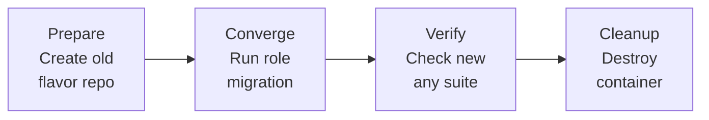

# Migration Test

This molecule scenario tests the migration from flavor-specific repositories to the universal `any` suite repository.

## What it tests

1. **Prepare Phase**: Sets up a deprecated flavor-specific cloudflare repository (e.g., `bookworm`, `jammy`, etc.)
2. **Converge Phase**: Runs the ansible role which should migrate to the `any` suite
3. **Verify Phase**: Confirms that:
   - The repository now uses `Suites: any`
   - The cloudflared package is installable and working
   - No flavor-specific suite remains in the configuration

## Running the test

```bash
# Run just the migration test
molecule test -s migration

# Or use the helper script
./test-migration.sh

# Run with specific distribution
MOLECULE_DOCKER_IMAGE=debian MOLECULE_DOCKER_TAG=12 molecule test -s migration
MOLECULE_DOCKER_IMAGE=ubuntu MOLECULE_DOCKER_TAG=24.04 molecule test -s migration
```

## Test Flow



This ensures that users with existing flavor-specific repositories will be seamlessly migrated to the new universal `any` suite.
